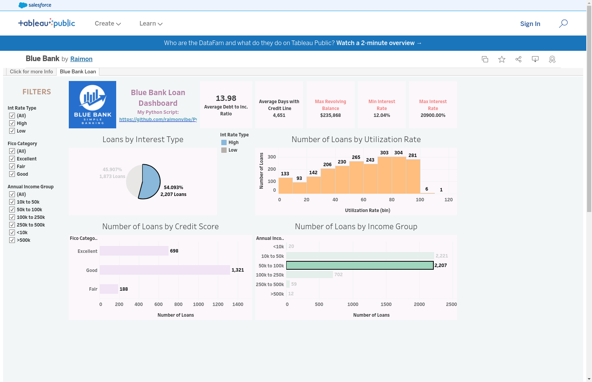

# Python and Tableau Data Analysis Projects

This repository contains a collection of Python scripts for data analysis and preparation, designed to work in conjunction with Tableau for visualization. The project demonstrates various data processing techniques, from basic data manipulation to sentiment analysis and financial calculations.

## Project Components

### 1. Blog Analysis (blogme.py)
A Python script that performs sentiment analysis on article titles using the VADER sentiment analyzer. Features include:
- Reading article data from Excel files
- Analyzing engagement metrics by source
- Performing sentiment analysis on article titles
- Flagging specific keywords in titles
- Exporting processed data for Tableau visualization

### 2. Value Inc Sales Analysis (valueInc_sales.py)
A comprehensive sales data analysis script that includes:
- Transaction data processing
- Cost and profit calculations
- Date field manipulation
- Client data parsing and cleaning
- Seasonal data integration
- Data export for Tableau visualization

### 3. Blue Bank Loan Analysis (bluebank.py)
A financial data analysis script focusing on loan data, featuring:
- JSON data processing
- FICO score categorization
- Interest rate analysis
- Income data transformation
- Data visualization using matplotlib
- Export capabilities for Tableau integration

## Prerequisites
The scripts require the following Python libraries:
- pandas
- numpy
- matplotlib
- vaderSentiment
- json

## Data Files Required
The scripts expect the following data files (not included in repository):
- `articles.xlsx` - For blog analysis
- `transaction.csv` - For sales analysis
- `value_inc_seasons.csv` - For seasonal data
- `loan_data_json.json` - For loan analysis

## Output Files
The scripts generate the following output files:
- `blogme_clean.xlsx` - Processed blog data
- `valueInc_Cleaned.csv` - Processed sales data
- `loan_cleaned.csv` - Processed loan data

These output files can be directly imported into Tableau for visualization and further analysis.

## Usage
Each script can be run independently based on your analysis needs. Make sure to place the required data files in the same directory as the scripts before running them.

## Tableau Dashboards
The processed data from these Python scripts has been visualized in Tableau Public. Below are the interactive dashboards created from each analysis:

### Value Inc. Sales Dashboard

[View Interactive Dashboard](https://public.tableau.com/app/profile/raimon3989/viz/ValueInc_DataAlalysis/Dashboard1)

This dashboard visualizes the sales data analysis, showing:
- Sales and cost trends over time
- Profit analysis by client demographics
- Business type performance
- Geographic distribution of sales

### BlogMe News Analysis Dashboard

[View Interactive Dashboard](https://public.tableau.com/app/profile/raimon3989/viz/BlogMeNewsAnalysis_16710099100050/BlogMeNewsDasboard)

This dashboard presents the news article analysis, featuring:
- Engagement metrics over time
- Source-wise article distribution
- Sentiment analysis results
- Keyword analysis visualization

### Blue Bank Loan Analysis Dashboard

[View Interactive Dashboard](https://public.tableau.com/app/profile/raimon3989/viz/BlueBank_16706669670710/BlueBankLoan)

This dashboard shows the loan data analysis, including:
- FICO score distribution
- Interest rate analysis
- Income-based metrics
- Loan purpose categorization

## Note
This repository demonstrates the integration between Python data processing and Tableau visualization capabilities, showcasing how to prepare and transform data programmatically before creating visual analytics in Tableau.
